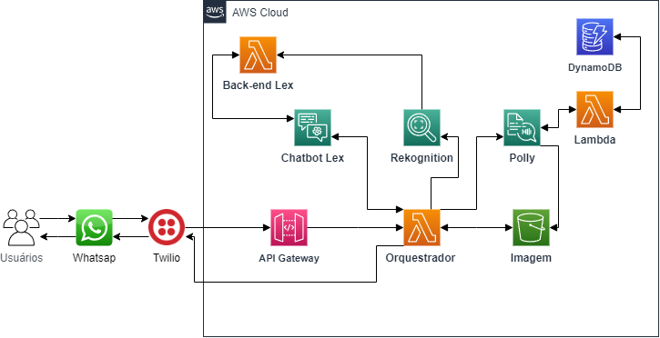

<!--

  

 -->
# Avaliação Sprints 9 e 10 - Projeto Final - Programa de Bolsas Compass UOL / AWS e Univesp

Avaliação das sprints 9 e 10 do programa de bolsas Compass UOL para formação em machine learning para AWS.

---

# Introdução

Projeto de desenvolvimento de um chatbot dedicado a auxiliar no reforço da alfabetização de jovens e adultos, especialmente diante dos desafios enfrentados pelo setor da educação no Brasil durante a pandemia. Este projeto foi impulsionado pela necessidade de fornecer uma solução que possa ajudar as crianças a superarem as dificuldades de aprendizado.

A pandemia da COVID-19 trouxe consigo uma série de desafios sem precedentes, afetando significativamente o setor da educação. Com o fechamento das escolas e a transição para o ensino remoto, muitos jovens enfrentaram interrupções em seu processo de alfabetização, uma fase fundamental para o desenvolvimento de habilidades de leitura e escrita. A falta de interação presencial com professores e colegas, além da limitada disponibilidade de recursos educacionais, levou a lacunas no aprendizado e diminuição do engajamento das crianças.

# Objetivo 

- Com base no contexto apresentado, o projeto visa utilizar o chatbot, como uma ferramenta de inteligência artificial, de forma a auxiliar a preencher essa lacuna e proporcionar um ambiente de aprendizagem virtual interativo e eficaz e promover acesso à educação e combater as consequências negativas da pandemia, garantindo que os jovens tenham a oportunidade de desenvolver habilidades de alfabetização.

# Funcionamento 

# Organização e fluxo de trabalho 
Foi construído um serviço que envolveu:
* Configuração inicial Amazon Lex:
    - Definição das intenções (intents): DitadoIntent, 	RepetirAtividade, SaudacaoIntent e FallbackIntent.
    - Criação dos slots: 
        - AudioSlot para capturar a palavra resposta do rekognition.
        - ReforcarSlot para capturar resposta de continuação ou não da atividade do usuário.
      
* Integração com o Amazon Rekognition:
    - Utilização do Amazon Rekognition para realizar análise de imagens e extrair informações relevantes.

* Integração com o Amazon Polly:
    - Utilização do Amazon Polly para converter texto em voz.

* Integração com o Twilio e WhatsApp:
    - Utilização do serviço do Twilio para enviar mensagens de texto e áudio via WhatsApp.

O chatbot vai interagir com o usuário por meio de mensagens de texto.

* Fluxo de trabalho do chatbot:
    - O chatbot inicia com uma saudação inicial (SaudacaoIntent), fornecendo uma introdução e instruções para o usuário.
    - O usuário será informado sobre a realização de um ditado (DitadoIntent) e receberá um áudio com a palavra.
    - O chatbot solicita ao usuário que envie a foto da palavra ditada, do áudio, via WhatsApp.
    - A foto é recebida pelo Amazon Rekognition e processada utilizando uma função lambda personalizada para conferir se a palavra escrita é a mesma ditada.
    - O chatbot fornece um feedback ao usuário.
    - Após o ditado, o chatbot pode oferecer a opção de realizar outro ditado ou finalizar.

# Arquitetura 

  
  
    
Arquitetura do projeto
 
  

## Serviços utilizados

- [Amazon Lex](https://docs.aws.amazon.com/lexv2/latest/dg/what-is.html)
    
- [Amazon Recokgnition](https://docs.aws.amazon.com/rekognition/latest/dg/what-is.html) 
- [Amazon Transcribe](https://docs.aws.amazon.com/transcribe/latest/dg/what-is.html)
-  [Amazon Translate](https://docs.aws.amazon.com/translate/latest/dg/what-is.html)
- [Amazon Polly](https://docs.aws.amazon.com/polly/latest/dg/what-is.html)
- [Twilio](https://www.twilio.com/pt-br/docs)

- [Whatsapp](https://business.whatsapp.com/developers/developer-hub)

# Instalação

## Etapas

- Definição do tema e construção da Arquietura base do projeto;
- Criar chatbot utilizando Amazon Lex;
- Integrar com seguintes serviços da AWS: Rekognition, Transcribe e Polly.
- Criar uma conta no [Twilio](https://www.twilio.com/)
- Integrar com Whatsapp

## Integrando o Amazon Lex com o Whatsapp via Twilio

- Twilio Console -> My account -> Copiar SID e Token

- Amazon Lex Console -> Bot versions -> Deployment -> Channel Integrations -> Add channel -> Platform - Twilio SMS -> Inserir Account SID e Authentication token -> Create -> Copiar url de endpoint gerado

- Twilio Console -> Messaging -> Settings -> Whatsapp sandbox settings -> Colar endpoint copiado em WHEN A MESSAGE COMES IN

# Dificuldades 

Entender todas as integrações que estão na arquitetura do projeto e o desenvolvimento das Lambdas para chamar e receber as informações dos usuários. 

# Referências 

[Kondado](https://kondado.com.br/blog/wiki/2020/11/03/adicionando-o-s3-como-destino-na-plataforma-da-kondado/)

# Desenvolvedores 

[ Ana Vitória](https://github.com/anaVitoriaLouro) | [ Bernardo Lima](https://github.com/belima93) | [ Luciene Godoy](https://github.com/LucieneGodoy) | [ Luiz Sassi](https://github.com/luizrsassi) | [ Kelly Silva](https://github.com/KellyPLSilva) | [ Viviane Alves](https://github.com/Vivianes86)|
| :---: | :---: | :---: | :---: | :---: | :---: | 

